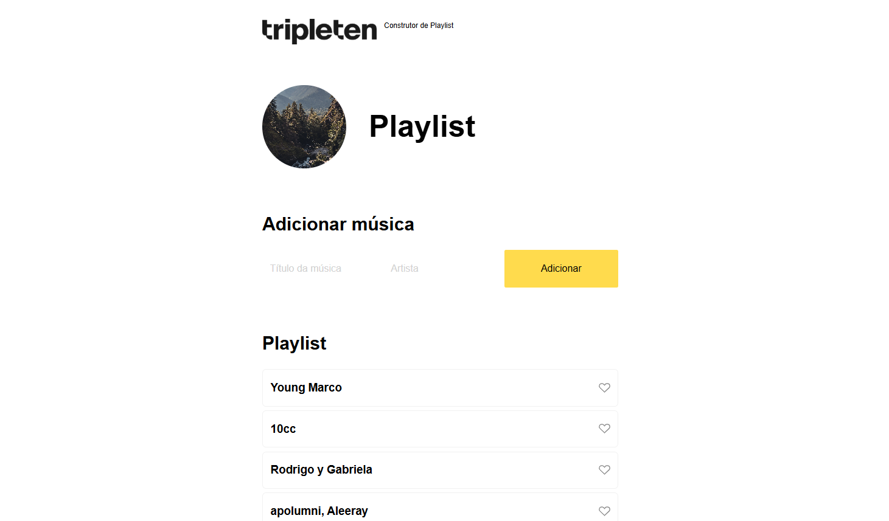

# Playlist Builder

## Project Overview 📊

A simple front-end project that lets users build a playlist by adding songs through a form. The app renders song cards dynamically using an HTML `<template>`, and updates the UI to hide the “No songs added” message once songs exist.

## Features ✨

• **Dynamic rendering from an array** (`initialSongs`)
• **DOM manipulation with templates** (`<template id="song-template">`)
• **Form handling** with `submit` event + `preventDefault()`
• **UI state control** using CSS classes (`no-songs_hidden`)
• **Clean, reusable function**: `addSong(artistValue, titleValue)`
• Automatically clears form inputs after adding a song

## Technologies Used 🛠️

• **HTML5**
• **CSS3**
• **JavaScript (Vanilla JS)**

## Project Structure 🗂️

• index.html
• style.css
• script.js

## How It Works ▶️

1. Rendering Songs

Songs are rendered by cloning a template:

• Clone the `.song` node from the template
• Fill the artist and title text
• Append the result into `.songs-container`

2. Empty State Message

The “No songs added” message is controlled by a CSS class:

• When songs exist, the project adds: `.no-songs_hidden`
• That class applies `display: none` to hide the message

## Getting Started ▶️

1. Download or clone the project
2. Open `index.html` in your browser
3. Add songs using the form

No build tools required.

## Current Behavior Notes 📝

• The playlist loads with a predefined list (`initialSongs`)
• The “Clear playlist” button exists in HTML but is not implemented yet (it is disabled by default)
• The “Like” button is styled but does not have JS behavior yet

## Next Improvements (Roadmap) 📌

• Enable and implement **Clear playlist**
• Add **Like** toggle functionality (active/inactive)
• Add input validation (prevent empty submissions)
• Prevent duplicate songs (optional)
• Save playlist to **localStorage** so it persists after refresh

## Author

• GitHub: https://github.com/RodrigoMZanetti
• LinkedIn: https://www.linkedin.com/in/rodrigomaturanozanetti/
